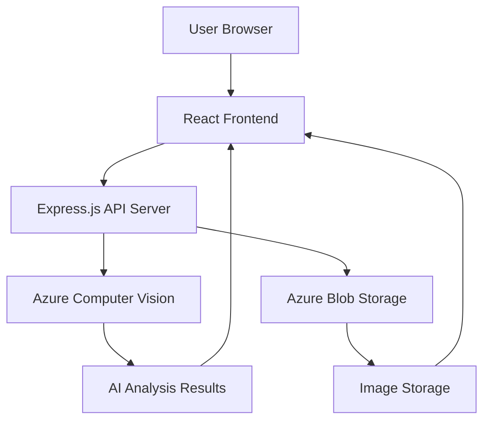

# 🧠 SmartVision AI - Azure-Powered Image Analysis Platform

## About the Project
SmartVision AI is a web application that allows users to upload an image and get an instant AI-powered analysis of its content. It can generate a caption, identify objects, and extract text from the image.

This project was built to demonstrate a full-stack application integrating a modern front-end with a powerful back-end API.

## ✨ Key Features
- 🎯 Core Capabilities
- 🤖 AI-Powered Image Analysis - Azure Computer Vision integration
- 📝 Intelligent Caption Generation - Automatic image description
- 🏷️ Advanced Object Detection - Multi-label tagging with confidence scores
- 🔤 OCR Text Extraction - Optical Character Recognition technology
- ☁️ Secure Cloud Storage - Azure Blob Storage integration

### Built With
* **Front-End:** HTML, CSS, JavaScript
* **Back-End:** Node.js, Express.js
* **AI Service:** Microsoft Azure Computer Vision API
* **Deployment Tools:** VS Code
  
## 🏗️ Architecture Overview


## Getting Started

### Prerequisites
Before you begin, ensure you have the following installed on your machine:
* [Node.js](https://nodejs.org/)
* [npm](https://www.npmjs.com/)

### Installation

1.  **Clone the repository:**
    ```bash
    git clone [https://github.com/your-username/SmartVision-AI.git](https://github.com/your-username/SmartVision-AI.git)
    ```
2.  **Navigate into the project directory:**
    ```bash
    cd SmartVision-AI
    ```
3.  **Install back-end dependencies:**
    ```bash
    npm install
    ```

## Usage

1.  **Start the server:**
    ```bash
    node server.js
    ```
2.  **Open the application:**
    Open your web browser and navigate to `http://localhost:3000`.
3.  **Analyze an image:**
    Drag and drop an image onto the designated area or click to select one, then click "Analyze Image." The analysis results will be displayed on the screen.

## 🚀 Deployment
VS Code → GitHub → Azure App Service

### **Quick Deployment Guide**

1. **Deploy to Azure** (using VS Code):
- Install "Azure App Service" extension
- Sign in to Azure account
- Right-click project → "Deploy to Web App"
- Select your Azure subscription and app service

2. **Push to GitHub** (from VS Code):
```bash
git init
git add .
git commit -m "Initial commit"
git branch -M main
git remote add origin https://github.com/your-username/smartvision-ai.git
git push -u origin main
```

3. **Configure Environment Variables** (in Azure Portal):
- Go to: App Service → Configuration → Application settings
- Add:
```bash
VISION_ENDPOINT = "your_azure_vision_endpoint"
VISION_KEY = "your_azure_vision_key" 
STORAGE_CONNECTION_STRING = "your_azure_storage_connection_string"
NODE_ENV = "production"
```
 
## Demo
- **🌐 Live URL:** [SmartVision AI](https://smartvision-app-dkgwgmfpgnbhanck.eastasia-01.azurewebsites.net/)
- **✅ Status:** Fully deployed and operational.
